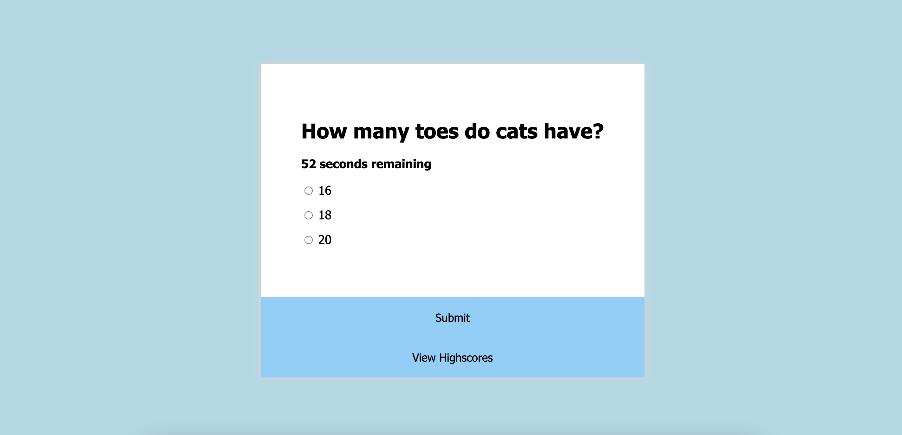

# 04-HW-Quiz

 
 

  ## Description
 A quiz about cats using HTML, CSS and JS. Test your cat knowledge! 

  ## Table of Contents
  - [Description](#description)
  - [Requirements](#requirements)
  - [Screenshot](#screenshot)
  - [Contributing](#credits)
  - [Questions](#questions)

  ## Requirements
    GIVEN I am taking a code quiz
    WHEN I click the start button
    THEN a timer starts and I am presented with a question
    WHEN I answer a question
    THEN I am presented with another question
    WHEN I answer a question incorrectly
    THEN time is subtracted from the clock
    WHEN all questions are answered or the timer reaches 0
    THEN the game is over
    WHEN the game is over
    THEN I can save my initials and my score
  

  ## Screenshot
   

  ## Questions
  Find me on GitHub: [melissahookey](https://github.com/melissahookey)
   
  Email me with any questions: melissah315@gmail.com
